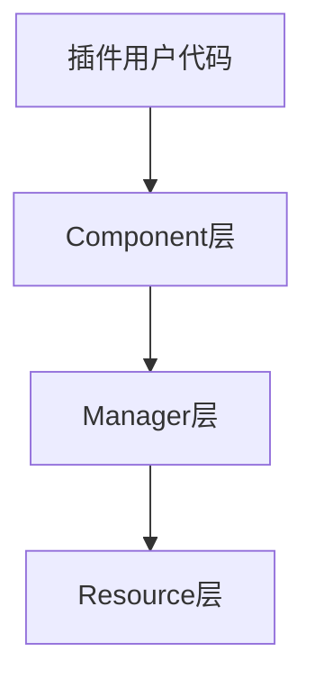
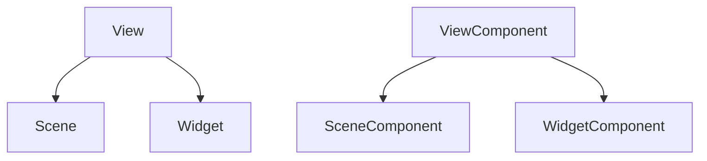

# UIFramework 架构设计

## 核心概念

### 分层设计



1. **Resource层**
   - 最底层的基础设施
   - 处理资源加载和缓存
   - 通常对插件用户不可见
   - 可由用户自定义扩展

2. **Manager层**
   - 全局服务提供者
   - 协调各个组件工作
   - 维护全局状态
   - 处理跨组件通信

3. **Component层**
   - 直接与节点交互
   - 提供具体功能
   - 是插件用户的主要接口
   - 自动与Manager层通信

### 核心抽象

#### View体系



1. **View**
   - UI元素的基础抽象
   - 提供数据绑定能力
   - 定义基本生命周期

2. **Scene**
   - 完整的UI界面
   - 处理界面关系
   - 支持模态显示
   - 管理界面组

3. **Widget**
   - 可复用UI控件
   - 支持状态重置
   - 轻量级设计
   - 简单生命周期

### 组件与管理器

#### Component的职责
- 提供节点级别的功能
- 维护局部状态
- 处理具体的UI逻辑
- 自动与Manager通信

#### Manager的职责
- 提供全局服务
- 协调组件工作
- 维护全局状态
- 处理资源管理

## 最佳实践

### 1. 使用Component而非Manager

```gdscript
# 推荐
@onready var scene = $UISceneComponent
func _ready():
    scene.initialize(data)

# 不推荐
func _ready():
    UIManager.scene_manager.initialize_scene(self, data)
```

### 2. 使用继承简化代码

```gdscript
# 推荐
class_name GameScene
extends UIScene

func _ready():
    self.initialize(data)

# 不推荐
class_name GameScene
extends Control

@onready var scene_component = $UISceneComponent
func _ready():
    scene_component.initialize(data)
```

### 3. 配置与逻辑分离

```gdscript
# 场景配置
var scene_config = UISceneType.new()
scene_config.id = "game_scene"
scene_config.group = "game"
scene_config.modal = true

# 场景逻辑
class GameScene extends UIScene:
    func _ready():
        self.initialize(initial_data)
```

## 扩展点

### 1. 资源管理
- 自定义资源加载策略
- 实现资源预加载
- 添加资源卸载策略

### 2. 界面管理
- 自定义界面组逻辑
- 实现特殊的模态效果
- 添加界面切换动画

### 3. 部件系统
- 自定义缓存策略
- 实现部件池
- 添加部件预加载

## 常见问题

### Q: 什么时候使用Manager？
A: 只在以下情况使用Manager：
- 需要全局状态管理
- 需要跨组件通信
- 需要资源管理服务

### Q: 如何选择Scene还是Widget？
A: 根据以下标准：
- Scene: 完整、独立的界面
- Widget: 可复用的UI控件

### Q: Type类是否必须？
A: 推荐使用Type类，因为：
- 便于配置管理
- 支持热重载
- 便于版本控制
