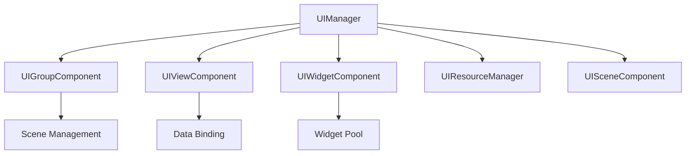

# UIFramework 核心架构

## 概述

UIFramework 是一个为Godot引擎设计的UI框架，它提供了一套完整的UI管理解决方案。框架采用组件化设计，通过统一的管理器来协调各个组件的工作。

## 核心组件



### UIManager

UIManager 是框架的核心，作为单例存在，负责管理UI资源、视图类型和组件。

```gdscript
# 注册视图类型
UIManager.register_view_type(view_type)

# 注册组件分组
UIManager.register_group("main", group_component)

# 创建视图
UIManager.create_view("player_info", parent_node, initial_data)
```

### 组件系统 (Component System)

#### UIViewComponent
基础视图组件，提供数据绑定和生命周期管理。

```gdscript
# 组件信号
signal initialized(data: Dictionary)
signal disposing(data: Dictionary)
signal data_updating(path: String, value: Variant)
signal data_updated(path: String, value: Variant)

# 初始化组件
view_component.initialize({
    "name": "Player1",
    "level": 10
})
```

#### UIGroupComponent
场景分组组件，管理同一分组下的场景切换和堆栈。

```gdscript
# 创建场景
group_component.create_scene("game_scene", {
    "player": player_data,
    "enemy": enemy_data
})

# 切换场景
group_component.switch_scene("battle_scene", battle_data)
```

#### UIWidgetComponent
可重用UI组件，支持对象池管理。

```gdscript
# 创建Widget
widget_component.create_widget("hp_bar", parent_node, {
    "current": 100,
    "max": 100
})

# 回收Widget
widget_component.recycle()
```

#### UISceneComponent
场景组件，处理场景的生命周期和数据流。

```gdscript
# 场景切换
scene_component.switch_scene("next_scene", scene_data)

# 场景信号
signal scene_ready(data: Dictionary)
signal scene_closing(data: Dictionary)
```

## 数据管理

### 响应式数据绑定
框架提供了响应式的数据绑定系统：

```gdscript
# 在视图组件中
func _on_data_updated(path: String, value: Variant) -> void:
    match path:
        "player.name":
            name_label.text = value
        "player.hp":
            hp_bar.value = value
```

### 数据流向
1. 组件初始化时设置初始数据
2. 通过信号系统通知数据更新
3. 组件内部处理数据变化
4. 销毁时清理数据

## 最佳实践

1. **组件化设计**
   - 将UI逻辑封装在对应的组件中
   - 使用信号进行组件间通信
   - 保持组件的独立性和可复用性

2. **数据管理**
   - 使用响应式数据绑定系统
   - 保持数据流向的清晰性
   - 适当使用数据路径系统

3. **场景管理**
   - 使用分组管理相关场景
   - 合理使用场景堆栈
   - 注意场景的生命周期管理

4. **资源管理**
   - 及时释放不需要的资源
   - 使用对象池管理频繁创建的UI元素
   - 注意内存使用
