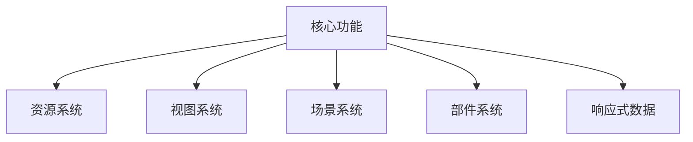
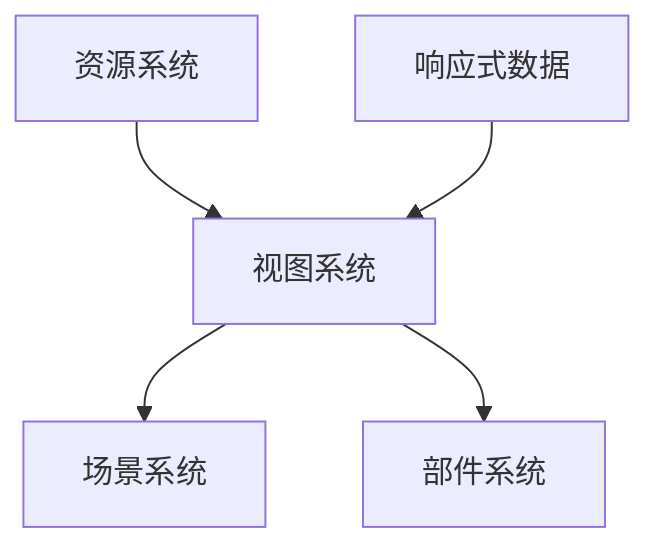

# 核心功能

## 概述

UIFramework的核心功能由以下几个主要部分组成：

## 功能模块

### [资源系统](resource_system.md)
- 资源加载和管理
- 资源类型定义
- 资源缓存策略
- 资源预加载机制

### [视图系统](view_system.md)
- UI元素的基础抽象
- 数据绑定机制
- 生命周期管理
- 组件通信

### [场景系统](scene_system.md)
- 完整界面管理
- 界面层级关系
- 模态窗口支持
- 界面组管理

### [部件系统](widget_system.md)
- 可复用控件
- 状态管理
- 对象池机制
- 部件复用策略

### [响应式数据](../reactive_data_binding.md)
- 数据绑定
- 自动更新机制
- 路径系统
- 性能优化

## 系统关系

## 使用建议

1. **系统选择**
   - 完整界面使用场景系统
   - 可复用控件使用部件系统
   - 数据驱动界面使用响应式数据

2. **性能考虑**
   - 合理使用资源预加载
   - 适当配置部件缓存
   - 优化数据更新路径

3. **扩展建议**
   - 自定义资源加载策略
   - 扩展场景转换效果
   - 实现特殊部件类型
