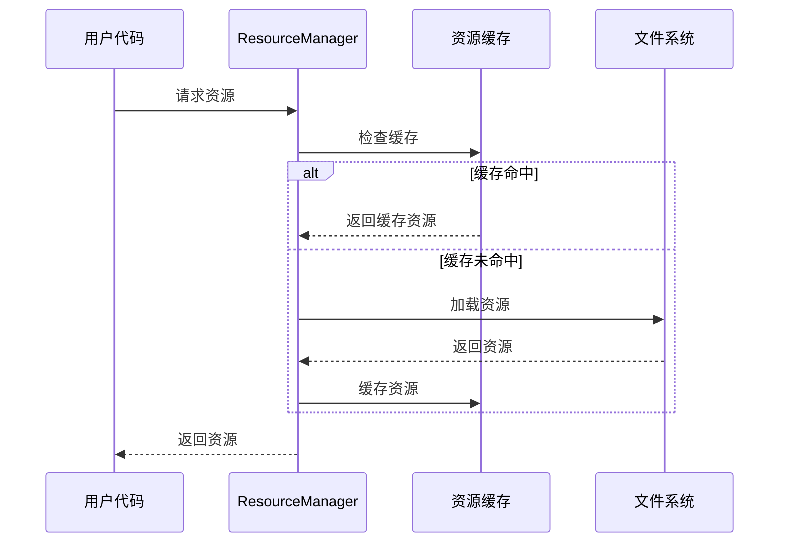

# 资源系统

## 概述

资源系统是UIFramework的基础设施，负责管理UI相关资源的加载、缓存和卸载。它是其他系统的基础支撑，但通常对插件用户是透明的。

## 核心功能

### 1. 资源类型

```gdscript
# 视图类型
class_name UIViewType
extends Resource

@export var id: String                 # 视图ID
@export var scene: PackedScene         # 场景资源
@export var persistent: bool = false   # 是否持久化

# 场景类型
class_name UISceneType
extends UIViewType

@export var group: String             # 场景组
@export var modal: bool = false       # 是否模态
@export var transition: String        # 转场效果

# 部件类型
class_name UIWidgetType
extends UIViewType

@export var cache_strategy: int       # 缓存策略
@export var pool_size: int = 10       # 池大小
```

### 2. 资源管理

```gdscript
# 资源加载
func load_scene(path: String) -> PackedScene:
    return _load_resource(path)

# 资源预加载
func preload_resources(types: Array[UIViewType]) -> void:
    for type in types:
        _preload_resource(type.scene)

# 资源卸载
func unload_resources(types: Array[UIViewType]) -> void:
    for type in types:
        _unload_resource(type.scene)
```

### 3. 缓存策略

```gdscript
enum CacheStrategy {
    NONE,           # 不缓存
    PRELOAD,        # 预加载
    LAZY,           # 懒加载
    PERSISTENT      # 持久化
}
```

## 工作流程



## 使用示例

### 1. 定义资源类型

```gdscript
# game_scene_type.tres
@tool
extends UISceneType

func _init():
    id = "game_scene"
    scene = preload("res://scenes/game_scene.tscn")
    group = "game"
    modal = false
```

### 2. 注册资源类型

```gdscript
# 在插件初始化时
func _init_resource_types():
    var game_scene = preload("res://types/game_scene_type.tres")
    UIManager.res_manager.register_type(game_scene)
```

### 3. 资源预加载

```gdscript
# 预加载场景资源
func _preload_game_resources():
    var types = [
        preload("res://types/main_menu_type.tres"),
        preload("res://types/game_scene_type.tres")
    ]
    UIManager.res_manager.preload_resources(types)
```

## 扩展点

### 1. 自定义加载策略

```gdscript
class CustomResourceLoader:
    func load_resource(path: String) -> Resource:
        # 自定义加载逻辑
        pass

# 设置自定义加载器
UIManager.res_manager.set_resource_loader(CustomResourceLoader.new())
```

### 2. 缓存策略扩展

```gdscript
class CustomCacheStrategy:
    func should_cache(type: UIViewType) -> bool:
        # 自定义缓存决策
        pass

# 设置自定义缓存策略
UIManager.res_manager.set_cache_strategy(CustomCacheStrategy.new())
```

### 3. 资源监控

```gdscript
class ResourceMonitor:
    func on_resource_loaded(path: String) -> void:
        print("Resource loaded: ", path)

# 添加资源监控
UIManager.res_manager.add_monitor(ResourceMonitor.new())
```

## 最佳实践

1. **资源组织**
   - 使用类型文件组织资源
   - 合理设置缓存策略
   - 预加载常用资源

2. **性能优化**
   - 避免运行时加载
   - 合理使用预加载
   - 及时释放不需要的资源

3. **扩展性**
   - 使用类型系统而非硬编码
   - 保持加载接口的一致性
   - 支持自定义加载策略

## 常见问题

1. **资源加载失败**
   - 检查路径是否正确
   - 确保资源文件存在
   - 验证资源类型匹配

2. **内存占用过高**
   - 检查缓存策略
   - 及时卸载资源
   - 使用延迟加载

3. **加载性能问题**
   - 使用预加载
   - 优化资源大小
   - 实现异步加载
