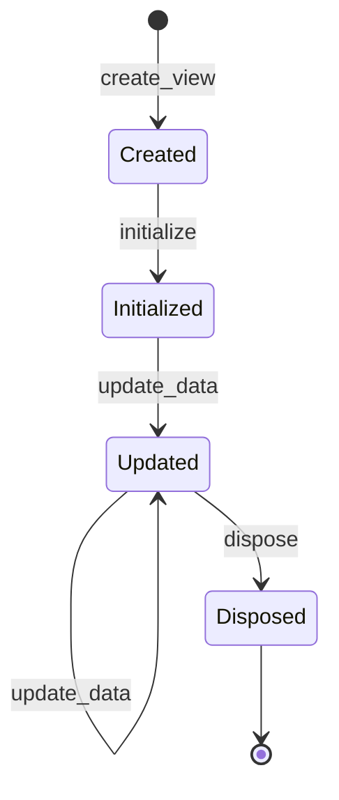

# 视图系统

## 概述

视图系统是UIFramework的核心抽象，它为UI元素提供了统一的接口和行为。视图系统是场景系统和部件系统的基础，定义了UI元素的基本特性和生命周期。

## 核心组件

### 1. 视图组件

```gdscript
class_name UIViewComponent
extends Node

# 信号
signal view_created()         # 视图创建完成
signal view_disposed()        # 视图销毁完成
signal data_updated(data)     # 数据更新

# 属性
@export var data_paths: Array[String]  # 关注的数据路径
@export var view_type: UIViewType      # 视图类型

# 数据模型
var model: ReactiveData              # 响应式数据模型
```

### 2. 视图类型

```gdscript
class_name UIViewType
extends Resource

@export var id: String                 # 视图ID
@export var scene: PackedScene         # 场景资源
@export var persistent: bool = false   # 是否持久化
```

## 生命周期



### 1. 创建阶段

```gdscript
# 视图创建
func create_view() -> void:
    # 初始化组件
    _setup_component()
    # 发送创建信号
    view_created.emit()

# 初始化数据
func initialize(data: Dictionary) -> void:
    # 设置初始数据
    model.initialize(data)
    # 更新视图
    _update_view(data)
```

### 2. 更新阶段

```gdscript
# 更新数据
func update_data(data: Dictionary, paths: Array[String] = []) -> void:
    # 检查是否需要更新
    if should_update(paths):
        # 更新数据模型
        model.update_values(data)
        # 通知数据更新
        data_updated.emit(model.to_dict())

# 数据路径检查
func should_update(paths: Array[String]) -> bool:
    # 没有指定路径则总是更新
    if data_paths.is_empty():
        return true
    
    # 检查路径匹配
    for path in paths:
        if _path_matches(path):
            return true
    
    return false
```

### 3. 销毁阶段

```gdscript
# 销毁视图
func dispose() -> void:
    # 清理数据
    model.clear()
    # 发送销毁信号
    view_disposed.emit()
```

## 数据绑定

### 1. 响应式数据

```gdscript
# 数据模型设置
func _setup_model() -> void:
    model = ReactiveData.new()
    model.value_changed.connect(_on_value_changed)

# 数据变化处理
func _on_value_changed(path: String, old_value, new_value) -> void:
    if should_update([path]):
        data_updated.emit(model.to_dict())
```

### 2. 路径系统

```gdscript
# 路径匹配
func _path_matches(path: String) -> bool:
    # 检查路径表达式
    for expr in data_paths:
        if _path_parser.evaluate(expr, [path]):
            return true
    return false

# 路径解析
class PathParser:
    func evaluate(expr: String, paths: Array[String]) -> bool:
        # 解析和评估路径表达式
        pass
```

## 使用示例

### 1. 基本用法

```gdscript
# 创建视图组件
@onready var view_component = $UIViewComponent

func _ready() -> void:
    # 设置数据路径
    view_component.data_paths = ["player.hp", "player.mp"]
    # 监听数据更新
    view_component.data_updated.connect(_on_data_updated)
    # 初始化数据
    view_component.initialize({
        "player": {
            "hp": 100,
            "mp": 50
        }
    })

func _on_data_updated(data: Dictionary) -> void:
    # 更新UI显示
    update_ui(data)
```

### 2. 继承用法

```gdscript
class_name PlayerView
extends UIView

func _ready() -> void:
    # 设置数据路径
    data_paths = ["player.hp", "player.mp"]
    # 初始化
    initialize({
        "player": {
            "hp": 100,
            "mp": 50
        }
    })

func _on_data_updated(data: Dictionary) -> void:
    # 更新UI显示
    update_ui(data)
```

## 扩展点

### 1. 自定义视图基类

```gdscript
class_name CustomView
extends UIView

# 添加通用功能
func show_loading() -> void:
    # 显示加载效果
    pass

func hide_loading() -> void:
    # 隐藏加载效果
    pass
```

### 2. 视图装饰器

```gdscript
class_name ViewDecorator
extends Node

func decorate_view(view: UIView) -> void:
    # 添加额外功能
    pass

# 使用装饰器
var decorator = ViewDecorator.new()
decorator.decorate_view(view)
```

## 最佳实践

1. **组件使用**
   - 合理设置数据路径
   - 及时清理监听器
   - 避免深层数据嵌套

2. **性能优化**
   - 使用精确的数据路径
   - 避免频繁更新
   - 合理使用数据缓存

3. **代码组织**
   - 使用继承简化代码
   - 保持视图职责单一
   - 复用通用功能

## 常见问题

1. **数据更新不生效**
   - 检查数据路径设置
   - 确认更新方法调用
   - 验证数据格式正确

2. **内存泄漏**
   - 及时销毁视图
   - 清理数据监听
   - 断开信号连接

3. **性能问题**
   - 优化更新频率
   - 使用合适的数据结构
   - 避免不必要的更新
